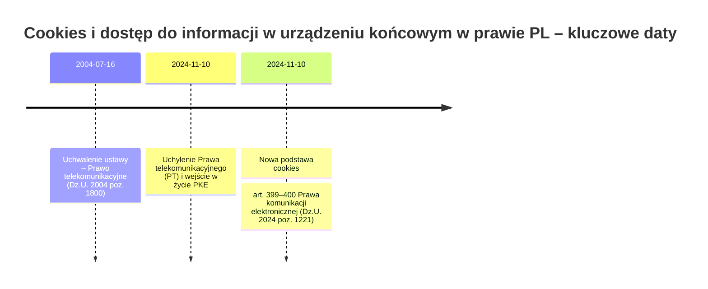
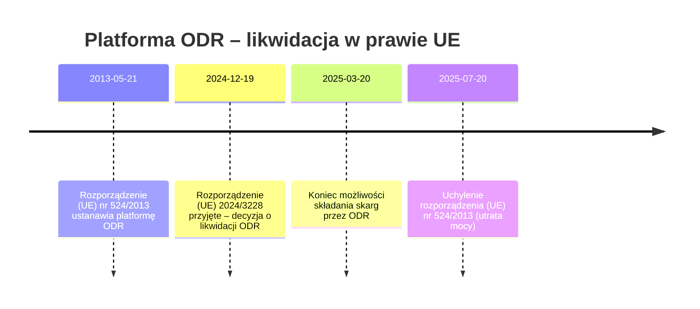

# Analiza aktualności podstaw prawnych i obowiązków wskazanych w dokumentach Revievv stan na 8 marca 2026 r.

## Status wdrożenia (aktualizacja 2026-03-14)

| Problem zidentyfikowany | Status | Data naprawy | Uwagi |
|---|---|---|---|
| Art. 173 PT → art. 399–400 PKE w Polityce prywatności | ✅ Naprawione | przed 2026-03-14 | Polityka prywatności v2.1 zawiera prawidłowe odniesienia do PKE |
| Platforma ODR w Regulaminie | ✅ Naprawione | przed 2026-03-14 | Odniesienie do ODR usunięte z Regulaminu v2.4 |
| B2B vs B2C — ryzyko prawne | ⚠️ Częściowo zaadresowane | 2026-03-13 | Płatne plany ograniczone do podmiotów z NIP (spec: b2b-only-paid-plans-design.md). Plan Starter nadal dostępny dla konsumentów. |
| Landing page — brak informacji o lokalizacji danych (EU) | ✅ Naprawione | 2026-03-14 | Dodano badge "Serwery w UE (Finlandia)" w hero + trust badges przy pricing |
| Landing page — ogólne info o szyfrowaniu | ✅ Naprawione | 2026-03-14 | Zmieniono na "AES-256 at rest" z podaniem Cloudflare R2 |
| Landing page — brak polityki AI | ✅ Naprawione | 2026-03-14 | Dodano sekcję "Twoje pliki nie trenują AI" w sekcji security |
| Landing page — brak trust badges przy pricing | ✅ Naprawione | 2026-03-14 | Dodano GDPR / EU-hosted / AES-256 pod kartami cenowymi |

### Pozostałe otwarte kwestie

- **Dedykowana strona /security** — 5 z 8 konkurentów ma osobną stronę bezpieczeństwa. Do rozważenia.
- **DPA jako osobny link w footer** — DPA jest wbudowane w ToS §15, ale enterprise buyers szukają osobnego linka.
- **Certyfikacje (SOC 2, ISO 27001)** — cel długoterminowy; liderzy (Filestage, Ziflow, Aproove) mają te certyfikaty.

---

## Streszczenie wykonawcze (oryginalna analiza z 2026-03-08)

Najważniejsze różnice między treścią dokumentów a stanem prawnym na dzień **2026-03-08** dotyczą dwóch obszarów: **cookies** oraz **platformy ODR**. W Polityce prywatności podano jako podstawę dla cookies m.in. **art. 173 Prawa telekomunikacyjnego** fileciteturn0file0, jednak **ustawa Prawo telekomunikacyjne (Dz.U. 2004 poz. 1800) została uchylona z dniem 10 listopada 2024 r.** citeturn6view0. Obowiązki dotyczące przechowywania informacji lub uzyskiwania dostępu do informacji w urządzeniu końcowym (praktycznie: cookies i podobne identyfikatory) są obecnie uregulowane w **Prawie komunikacji elektronicznej (Dz.U. 2024 poz. 1221), w szczególności art. 399–400** citeturn12view0turn5view0.

W Regulaminie wskazano możliwość skorzystania przez konsumentów z **platformy ODR** fileciteturn0file1. Tymczasem **możliwość składania skarg przez platformę ODR wygasła 20 marca 2025 r.**, zaś rozporządzenie ustanawiające ODR (UE) nr 524/2013 **traci moc od 20 lipca 2025 r.** na podstawie **rozporządzenia (UE) 2024/3228** citeturn41view0. W efekcie zapis o ODR jest na dzień 2026-03-08 co najmniej **praktycznie nieaktualny** (platforma powinna być zlikwidowana), a potencjalnie **wprowadzający w błąd**.

Pozostałe kluczowe odniesienia – w szczególności do **RODO (rozporządzenia (UE) 2016/679)** oraz do modelu **SCC** przy transferach do USA – pozostają co do zasady aktualne: RODO obowiązuje citeturn48search7turn48search12, a standardowe klauzule umowne w aktualnym modelu wynikają z **decyzji wykonawczej Komisji (UE) 2021/914**, która jest aktem **obowiązującym** citeturn42search0. RODO było korygowane sprostowaniami (m.in. Dz.Urz. UE L 127/2018 i Dz.Urz. UE L 74/2021), ale nie oznacza to uchylenia wskazywanych w dokumentach art. 6, 15–21, 28, 32 i 33 citeturn48search0turn13search1turn48search12.

## Metodyka i zakres

Analiza obejmuje dwa dostarczone dokumenty: **Politykę prywatności** fileciteturn0file0 oraz **Regulamin / postanowienia związane z DPA** fileciteturn0file1. Najpierw wyodrębniono wszystkie wskazane w dokumentach **akty prawne, regulacje i konkretne przepisy** (artykuły/ustępy/litery/punkty). Następnie zweryfikowano ich status na dzień **2026-03-08** w oparciu o źródła pierwotne: polski system ELI i API Sejmu (dla Dz.U.) citeturn6view0turn5view0turn12view0turn14view0turn16view0 oraz EUR-Lex i Dziennik Urzędowy UE (dla prawa UE) citeturn48search7turn41view0turn42search0turn13search1turn48search0.

Jeżeli w dokumentach wskazano „reżimy” bez precyzyjnego aktu (np. „listy sankcyjne UE” albo „ITAR/EAR”), oznaczono je jako **nieokreślone** – brak możliwości jednoznacznej walidacji „konkretnego przepisu” bez doprecyzowania, o który akt/listę chodzi.

## Wykaz wszystkich cytowań i odniesień prawnych w dokumentach

W dokumentach zidentyfikowano następujące cytowania i odniesienia (z zachowaniem brzmienia użytego w dokumentach tam, gdzie jest wprost podane):

Polityka prywatności zawiera odwołania do RODO jako podstaw przetwarzania: **art. 6 ust. 1 lit. b** (wykonanie umowy), **lit. f** (uzasadniony interes), **lit. a** (zgoda) i **lit. c** (obowiązek prawny) fileciteturn0file0. Zawiera także wykaz praw osób, których dane dotyczą: **art. 15–18, 20–21 RODO** fileciteturn0file0. W części cookies jako podstawę wskazuje **„art. 6 ust. 1 lit. a RODO oraz art. 173 Prawa telekomunikacyjnego”** fileciteturn0file0, a także odwołuje się do mechanizmu zgód (Cookiebot) i logów zgody w celu wykazania zgodności z RODO fileciteturn0file0. Dodatkowo w kontekście transferów do USA Polityka prywatności wskazuje na **Standardowe Klauzule Umowne (SCC) zatwierdzone przez Komisję Europejską** fileciteturn0file0.

Regulamin wskazuje (i) relację B2B z dopuszczalnością udziału konsumentów oraz odniesienie do **ustawy o prawach konsumenta** fileciteturn0file1, (ii) informację o możliwości skorzystania z **platformy ODR** fileciteturn0file1, (iii) kwalifikację ról w RODO: **administrator danych (art. 4 pkt 7 RODO)** oraz **podmiot przetwarzający (art. 4 pkt 8 RODO)** fileciteturn0file1, (iv) odniesienie do DPA zgodnej z **art. 28 RODO** fileciteturn0file1, (v) obowiązki bezpieczeństwa **art. 32 RODO** fileciteturn0file1 oraz (vi) informację o powiadomieniu o naruszeniu „zawierając dostępne informacje wymagane art. 33 ust. 3 RODO” fileciteturn0file1. Regulamin ponownie odwołuje się do **SCC** przy transferach do USA fileciteturn0file1. Ponadto zawiera odniesienia o charakterze compliance do „list sankcyjnych UE, USA (OFAC SDN), ONZ” oraz do „ITAR/EAR lub europejskich odpowiedników” fileciteturn0file1 – bez wskazania konkretnych podstaw prawnych (akty nie zostały zidentyfikowane wprost w tekście).

## Tabela weryfikacyjna statusu prawa i wpływu na obowiązki

| Oryginalne odniesienie w dokumentach | Status na 2026-03-08 | Ostatnia istotna zmiana / status | Praktyczny wpływ na obowiązki w dokumentach | Źródło pierwotne |
|---|---|---|---|---|
| Art. 6 ust. 1 lit. a RODO fileciteturn0file0 | Obowiązuje | RODO obowiązuje; istnieją sprostowania (m.in. 2018 i 2021) citeturn48search0turn13search1turn48search12 | Podstawa „zgoda” pozostaje prawidłowa dla wskazanych celów (np. marketing do nie-klientów, cookies analityczne/marketingowe – z zastrzeżeniem właściwej podstawy krajowej dla cookies). | citeturn48search7turn48search12turn48search0turn13search1 |
| Art. 6 ust. 1 lit. b RODO fileciteturn0file0 | Obowiązuje | jw. citeturn48search12 | Podstawa „wykonanie umowy” nadal adekwatna dla świadczenia usługi/obsługi konta, jeżeli przetwarzanie jest niezbędne do wykonania umowy. | citeturn48search12turn48search7 |
| Art. 6 ust. 1 lit. c RODO fileciteturn0file0 | Obowiązuje | jw. citeturn48search12 | „Obowiązek prawny” pozostaje właściwą podstawą np. dla obowiązków podatkowo-rachunkowych. | citeturn48search12turn48search7 |
| Art. 6 ust. 1 lit. f RODO fileciteturn0file0 | Obowiązuje | jw. citeturn48search12 | „Uzasadniony interes” pozostaje właściwą podstawą m.in. dla bezpieczeństwa/logów/antyfraud, o ile przeprowadzono test równowagi i respektuje się sprzeciw tam, gdzie przysługuje. | citeturn48search12turn48search7 |
| Art. 15 RODO fileciteturn0file0 | Obowiązuje | jw. citeturn48search12 | Obowiązek realizacji prawa dostępu pozostaje aktualny. | citeturn48search12turn48search7 |
| Art. 16 RODO fileciteturn0file0 | Obowiązuje | jw. citeturn48search12 | Obowiązek sprostowania danych pozostaje aktualny. | citeturn48search12turn48search7 |
| Art. 17 RODO fileciteturn0file0 | Obowiązuje | jw. citeturn48search12 | Prawo do usunięcia („bycia zapomnianym”) pozostaje aktualne. | citeturn48search12turn48search7 |
| Art. 18 RODO fileciteturn0file0 | Obowiązuje | jw. citeturn48search12 | Prawo do ograniczenia przetwarzania pozostaje aktualne. | citeturn48search12turn48search7 |
| Art. 20 RODO fileciteturn0file0 | Obowiązuje | jw. citeturn48search12 | Prawo do przenoszenia danych (w zakresie przesłanek) pozostaje aktualne. | citeturn48search12turn48search7 |
| Art. 21 RODO fileciteturn0file0 | Obowiązuje | jw. citeturn48search12 | Prawo sprzeciwu (w tym wobec marketingu bezpośredniego) pozostaje aktualne. | citeturn48search12turn48search7 |
| Art. 4 pkt 7 RODO fileciteturn0file1 | Obowiązuje | jw. citeturn48search12 | Definicja administratora danych – fundament prawidłowej kwalifikacji ról w DPA i w relacji Usługodawca–Użytkownik. | citeturn48search12turn48search7 |
| Art. 4 pkt 8 RODO fileciteturn0file1 | Obowiązuje | jw. citeturn48search12 | Definicja podmiotu przetwarzającego – kluczowe dla obowiązków z art. 28 RODO. | citeturn48search12turn48search7 |
| Art. 28 RODO fileciteturn0file1 | Obowiązuje | jw. citeturn48search12 | Wymóg posiadania umowy powierzenia / DPA o treści odpowiadającej art. 28. Nadal w pełni aktualne. | citeturn48search12turn48search7 |
| Art. 32 RODO fileciteturn0file1 | Obowiązuje | jw. citeturn48search12 | Wymóg zastosowania odpowiednich środków technicznych i organizacyjnych (TOMs). Nadal aktualne. | citeturn48search12turn48search7 |
| Art. 33 ust. 3 RODO fileciteturn0file1 | Obowiązuje | Sprostowanie 2021 dotyka m.in. brzmienia art. 33 w wybranych wersjach językowych citeturn13search1 | Dokumenty odnoszą „informacje wymagane art. 33 ust. 3” do informacji przekazywanych Użytkownikowi (administratorowi). Co do zasady kierunek jest zgodny z funkcją art. 33 (treść zgłoszenia naruszenia), ale warto doprecyzować, że art. 33 ust. 3 dotyczy danych, które administrator przekazuje organowi nadzorczemu. | citeturn48search12turn13search1 |
| Art. 173 Prawa telekomunikacyjnego fileciteturn0file0 | **Nie obowiązuje** – akt uchylony | Prawo telekomunikacyjne (Dz.U. 2004 poz. 1800) uchylone od 2024-11-10 citeturn6view0 | Powołanie art. 173 jest nieaktualne. Obowiązki cookies zostały przeniesione do Prawa komunikacji elektronicznej; dokumenty powinny zostać zaktualizowane, bo obecnie właściwą podstawą krajową są art. 399–400 PKE. | citeturn6view0turn12view0turn5view0 |
| Ustawa z dnia 12 lipca 2024 r. Prawo komunikacji elektronicznej (Dz.U. 2024 poz. 1221) – **art. 399–400** (odpowiednik cookies) | Obowiązuje | Wejście w życie zasadniczo 2024-11-10 citeturn5view0; treść art. 399–400 citeturn12view0 | Art. 399 wprowadza warunki legalności „cookies”: uprzednia informacja, zgoda, brak zmian konfiguracyjnych i wyjątki konieczności; art. 400 odsyła do przepisów o ochronie danych przy uzyskaniu zgody. To jest obecnie realny rdzeń obowiązków cookie-bannerów. | citeturn5view0turn12view0 |
| Ustawa o prawach konsumenta fileciteturn0file1 | Obowiązuje | Akt ma tekst jednolity; ostatni tekst jednolity: obwieszczenie Dz.U. 2024 poz. 1796 citeturn16view0turn43search17 | Sama wzmianka w Regulaminie („serwis nie jest dostosowany do potrzeb konsumentów”) nie znosi obowiązków wobec konsumentów, jeśli faktycznie zawieracie umowy B2C. Ryzyko niespójności praktyk z reżimem konsumenckim zależy od realnego modelu sprzedaży. | citeturn16view0turn14view0turn43search17 |
| Platforma ODR (ec.europa…/consumers/odr) fileciteturn0file1 | **W praktyce nieaktualne / system zlikwidowany** | Rozporządzenie (UE) 2024/3228: możliwość składania skarg przez ODR wygasa 2025-03-20; rozporządzenie (UE) nr 524/2013 traci moc 2025-07-20 citeturn41view0 | Obowiązek linkowania do ODR (który wynikał z uchylanego rozporządzenia 524/2013) co do zasady przestaje mieć podstawę; informacja w Regulaminie może prowadzić użytkownika do nieistniejącej już ścieżki. | citeturn41view0 |
| Standardowe Klauzule Umowne (SCC) zatwierdzone przez KE fileciteturn0file0turn0file1 | Obowiązuje (instrument UE) | Decyzja wykonawcza KE (UE) 2021/914 jest „In force” citeturn42search0 | Odwołania do SCC jako zabezpieczenia transferu do USA są nadal zasadniczo poprawne. Warto jednak upewnić się, że faktycznie stosowany jest aktualny wzór SCC i wykonano ocenę transferu (TIA) zgodnie z praktyką po Schrems II (nie cytowane w dokumentach). | citeturn42search0 |
| „Listy sankcyjne UE, USA (OFAC SDN), ONZ” fileciteturn0file1 | **Nieokreślone** (brak wskazania aktu/listy) | Brak możliwości wskazania „ostatniej zmiany” bez doprecyzowania, które listy/akty UE dotyczą (sankcje UE mają postać wielu rozporządzeń Rady). | W dokumentach jest to warunek korzystania z usługi, ale bez wskazania konkretnej podstawy prawnej nie da się wykonać weryfikacji „czy przepis obowiązuje” w rozumieniu zadania. | Nie wskazano (w dokumencie brak konkretnego aktu) |
| „ITAR/EAR lub europejskie odpowiedniki” fileciteturn0file1 | **Nieokreślone** (prawo obce / brak konkretu) | ITAR/EAR to reżimy prawa USA; „europejskie odpowiedniki” mogą oznaczać różne akty (np. dot. dóbr podwójnego zastosowania), ale dokument nie precyzuje. | Postanowienie jest klauzulą compliance w regulaminie; bez doprecyzowania nie da się przypisać do jednego aktu prawnego i zweryfikować zmian. | Nie wskazano (w dokumencie brak konkretnego aktu) |

## Analiza obowiązków i zmian merytorycznych

### RODO jako fundament obowiązków informacyjnych, praw osób i DPA

Odwołania do art. 6 ust. 1 lit. a–c,f RODO w Polityce prywatności fileciteturn0file0 odpowiadają typowemu modelowi „mapowania” celów przetwarzania na podstawy legalności. Na dzień 2026-03-08 RODO nadal obowiązuje citeturn48search12turn48search7. Zidentyfikowane sprostowania RODO (m.in. 2018 i 2021) są publikowane w Dz.Urz. UE citeturn48search0turn13search1 i nie mają charakteru uchylenia rozdziału II/III/IV, do których odwołują się dokumenty.

Obowiązki wynikające z praw osób, których dane dotyczą (art. 15–21 RODO) pozostają co do zasady niezmienne w sensie „czy istnieją i trzeba je realizować” citeturn48search12turn48search7. Praktycznie oznacza to konieczność posiadania procesu obsługi żądań (w tym identyfikacji i weryfikacji osoby, terminów, dokumentowania, wyjątków), a także spójności tego procesu z deklaracjami w dokumentach (np. kanały kontaktu).

W Regulaminie poprawnie zidentyfikowano role administrator/podmiot przetwarzający w oparciu o art. 4 pkt 7 i 8 RODO fileciteturn0file1, a także wskazano DPA zgodne z art. 28 RODO oraz zobowiązania bezpieczeństwa na tle art. 32 RODO fileciteturn0file1. Na poziomie „czy przepisy nadal obowiązują” – tak, art. 28 i art. 32 nadal obowiązują citeturn48search12turn48search7.

W odniesieniu do naruszeń, dokument przewiduje powiadomienie Użytkownika w ciągu 48 godzin i wskazuje, że ma ono zawierać informacje wymagane art. 33 ust. 3 RODO fileciteturn0file1. Art. 33 ust. 3 dotyczy katalogu informacji zgłaszanych organowi nadzorczemu; sprostowanie z 2021 r. pokazało, że w części wersji językowych doprecyzowano brzmienie m.in. art. 33 citeturn13search1. Z perspektywy praktycznej rekomendowane jest doprecyzowanie w DPA, że obowiązek procesora polega na „niezwłocznym poinformowaniu administratora po stwierdzeniu naruszenia” oraz przekazaniu danych umożliwiających administratorowi wykonanie obowiązków z art. 33–34 RODO (co odpowiada typowej funkcji relacji procesor–administrator).

### Cookies i identyfikatory online

Kluczowa zmiana: dokumenty odwołują się do art. 173 Prawa telekomunikacyjnego jako podstawy dla cookies fileciteturn0file0, ale **Prawo telekomunikacyjne zostało uchylone od 2024-11-10** citeturn6view0. Obecnie analogiczne obowiązki znajdują się w **Prawie komunikacji elektronicznej**. Z punktu widzenia treści obowiązków, art. 399 PKE reguluje legalność przechowywania informacji/uzyskiwania dostępu do informacji na urządzeniu końcowym, wprowadzając trzy warunki: uprzednie poinformowanie (o celu oraz możliwościach ustawień), uzyskanie zgody po otrzymaniu informacji oraz brak zmian konfiguracyjnych citeturn12view0. Art. 399 ust. 3 PKE przewiduje wyjątki, gdy działanie jest konieczne do transmisji komunikatu albo do świadczenia usługi żądanej przez użytkownika citeturn12view0. Art. 400 PKE przesądza, że do uzyskania zgody stosuje się odpowiednio przepisy o ochronie danych osobowych citeturn12view0.

W praktyce oznacza to, że wdrożone w dokumencie założenie „zgoda + baner cookie + możliwość zmiany preferencji” pozostaje co do zasady zgodne z rdzeniem obowiązków, ale wymaga **korekty podstawy prawnej**: zamiast art. 173 PT należy wskazać – co najmniej – **art. 399–400 PKE** (oraz, jeśli chcecie zachować podwójną podstawę, nadal można wskazywać art. 6 ust. 1 lit. a RODO dla przetwarzania danych osobowych związanych z cookies, tam gdzie to przetwarzanie zachodzi) citeturn12view0turn5view0turn48search12.

### Konsumenci, ustawa o prawach konsumenta i deklaracja „B2B”

Regulamin wskazuje, że serwis jest przeznaczony dla B2B, choć dopuszcza korzystanie przez konsumentów, jednocześnie deklarując, że „Serwis nie jest dostosowany do potrzeb konsumentów w rozumieniu ustawy o prawach konsumenta” fileciteturn0file1. Ustawa o prawach konsumenta pozostaje aktem obowiązującym citeturn14view0turn16view0, a jej aktualny tekst jednolity ogłoszono obwieszczeniem w Dz.U. 2024 poz. 1796 citeturn16view0turn43search17.

Z perspektywy „czy obowiązki mogą Was dotyczyć”, kluczowe jest nie to, co deklaruje regulamin, lecz to, czy w praktyce umożliwiacie konsumentom zawieranie umów na odległość (i czy komunikacja/checkout nie wyłącza konsumentów). Jeżeli konsument faktycznie może kupić usługę/subskrypcję, to reżim konsumencki (m.in. obowiązki informacyjne, zasady odstąpienia, specyfika treści/usług cyfrowych) może znaleźć zastosowanie. Sama deklaracja „nie dostosowany” nie stanowi mechanizmu derogacji ustawy – ryzyko polega więc na możliwej rozbieżności pomiędzy „dopuszczalnością” a wdrożeniem obowiązkowych elementów B2C.

### ODR jako obowiązek informacyjny

Regulamin podaje możliwość skorzystania z platformy ODR fileciteturn0file1. Tymczasem **rozporządzenie (UE) 2024/3228** ustanawia harmonogram likwidacji: możliwość składania skarg przez ODR wygasa 2025-03-20, a rozporządzenie (UE) nr 524/2013 traci moc od 2025-07-20 citeturn41view0. Na dzień 2026-03-08 to oznacza, że utrzymywanie odwołania do ODR jest nieadekwatne (platforma ma być zlikwidowana), a ponadto nie wynika już z niego „aktualny obowiązek prawny” linkowania. Z perspektywy dokumentów: to nie tyle sprzeczność z prawem (bo można informować o czymś dodatkowo), ile przede wszystkim **informacja o ścieżce, która przestała funkcjonować w systemie prawa UE**.

## Niespójności dokumentów z obowiązującym prawem i korekty redakcyjne

> **Aktualizacja 2026-03-14:** Dwa najważniejsze problemy zostały naprawione. Szczegóły w tabeli "Status wdrożenia" na początku dokumentu. Trzeci (B2B vs B2C) częściowo zaadresowany — płatne plany wymagają NIP od 2026-03-13.

Najbardziej krytyczna niespójność dotyczy powołania **art. 173 Prawa telekomunikacyjnego** jako podstawy prawnej cookies w Polityce prywatności fileciteturn0file0. Ponieważ Prawo telekomunikacyjne zostało **uchylone** citeturn6view0, rekomendowana jest zmiana odniesienia na **Prawo komunikacji elektronicznej, art. 399–400** citeturn12view0turn5view0 oraz ewentualne doprecyzowanie rozdziału o cookies w duchu przesłanek z art. 399 (informacja, zgoda, wyjątki „konieczności”).

Druga wyraźna niespójność dotyczy ODR: zapis o platformie ODR w Regulaminie fileciteturn0file1 jest nieaktualny względem rozporządzenia (UE) 2024/3228 citeturn41view0. Zalecana korekta to usunięcie odniesienia do ODR albo zastąpienie go informacją o dostępnych mechanizmach ADR w Polsce/UE bez wskazywania nieistniejącej platformy, z zachowaniem zgodności z prawem konsumenckim.

Trzeci obszar ryzyka (bardziej „materialny” niż formalny) dotyczy konstrukcji B2B z dopuszczalnością konsumentów: Regulamin dopuszcza konsumentów, ale stwierdza brak dostosowania do potrzeb konsumentów fileciteturn0file1. W kontekście obowiązywania ustawy o prawach konsumenta citeturn16view0turn14view0 rekomendowane jest podjęcie decyzji produktowo-prawnej: albo realne ograniczenie dystrybucji do B2B (w tym UX/checkout i komunikacja), albo uzupełnienie regulacji i procesów o wymagane elementy B2C.

### Wizualizacje zmian i obowiązków

Poniższa oś czasu pokazuje zmianę podstawy prawnej cookies w Polsce – najistotniejszą zidentyfikowaną rozbieżność citeturn6view0turn5view0turn12view0:



Oś czasu dla likwidacji ODR (ważne wprost dla zapisu Regulaminu) citeturn41view0turn0file1:



Schemat decyzyjny „cookies / identyfikatory” zgodnie z obecnym brzmieniem PKE (art. 399) citeturn12view0:

```mermaid
flowchart TD
  A[Zamierzasz przechowywać informację lub uzyskać dostęp do informacji w urządzeniu końcowym?] -->|Nie| Z[Reżim art. 399 PKE nie dotyczy]
  A -->|Tak| B{Czy to jest konieczne do transmisji komunikatu lub świadczenia usługi żądanej przez użytkownika?}
  B -->|Tak| C[Możliwe zastosowanie wyjątku (art. 399 ust. 3 PKE) – nadal wymagaj oceny konieczności]
  B -->|Nie| D[Zapewnij uprzednią informację: cel + możliwość ustawień]
  D --> E[Uzyskaj zgodę użytkownika po informacji]
  E --> F[Upewnij się, że brak zmian konfiguracyjnych w urządzeniu i oprogramowaniu]
  F --> G[Udokumentuj wybór i umożliw łatwą zmianę preferencji]
```

